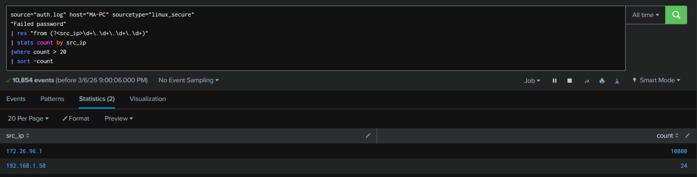
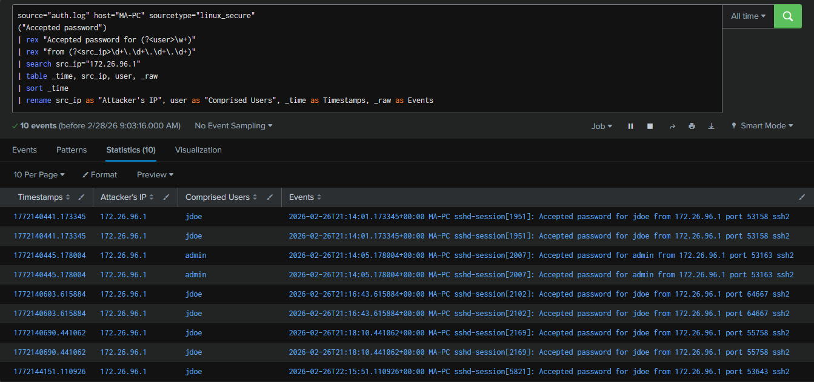

# 🔐 SOC Linux Attack Investigation using Splunk (SIEM)

> ⚠️ This project was conducted in a controlled lab environment for educational and defensive security purposes only.

---

## 📌 Executive Summary

This project simulates a real-world Linux compromise and demonstrates how a Security Operations Centre (SOC) analyst investigates attacker activities using Splunk SIEM.

The attack lifecycle includes:

- SSH Brute Force
- Successful SSH Authentication
- Privilege Escalation to Root
- Backdoor User Creation (Persistence)

The Linux authentication logs (`/var/log/auth.log`) were ingested into Splunk and analysed to investigate the full attack chain.

---

## 🎯 Objectives

- Simulate realistic adversary techniques
- Investigate Linux authentication logs
- Develop SPL detection queries
- Map attacker behaviour to MITRE ATT&CK
- Document incident response workflow

---

## 🔎 Attack Overview

The attacker performed a brute force attack against SSH, gained valid credentials, escalated privileges to root, and established persistence by creating an account for backdoor access.

The investigation identified:

- Repeated failed login attempts from the attacker's IP
- Successful login following brute force activity
- Root-level privilege escalation via sudo
- Creation of unauthorised local account

---

## Key Detections

## 🔍 Key Detections

Attack investigated by ingesting `/var/log/auth.log` into Splunk, with SPL queries revealing the attack chain.

### Brute Force (T1110)

Over 7200 failed SSH attempts from 172.26.96.1, preceded by success, indicating brute-force.

### Successful Auth (T1078)

*Additional Detections: `/screenshots/` (privilege escalation, persistence).*
---

## 🗂 Detailed Documentation

| File | Description |
|------|------------|
| 📄 incident_timeline.md | Chronological reconstruction of the attack |
| 📄 splunk_queries.md | Full SPL queries used for detection |
| 📄 mitre_mapping.md | MITRE ATT&CK technique mapping |
| 🗂 screenshots | Picture evidence |

---

## 🚨 MITRE ATT&CK Techniques Identified

- T1110 – Brute Force  
- T1078 – Valid Accounts  
- T1548.003 – Sudo Privilege Escalation  
- T1136.001 – Create Local Account    

---

## 🔥 Overall Impact

The attacker achieved:

- Remote authenticated access
- Root-level control
- Dual persistence mechanisms

**Severity Assessment: Critical**

---

## 🛡️ Security Recommendations

- Disable SSH password authentication (enforce key-based auth)
- Implement Fail2Ban to prevent brute force attacks
- Rotate credentials for compromised accounts
- Remove unauthorised accounts (backdoor_user)
- Restrict sudo privileges
- Monitor account creation events
- Enable centralised SIEM alerting

---
