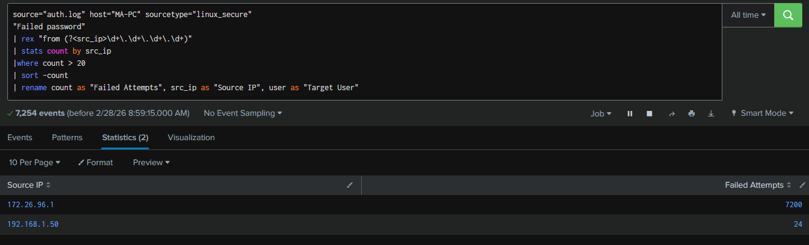
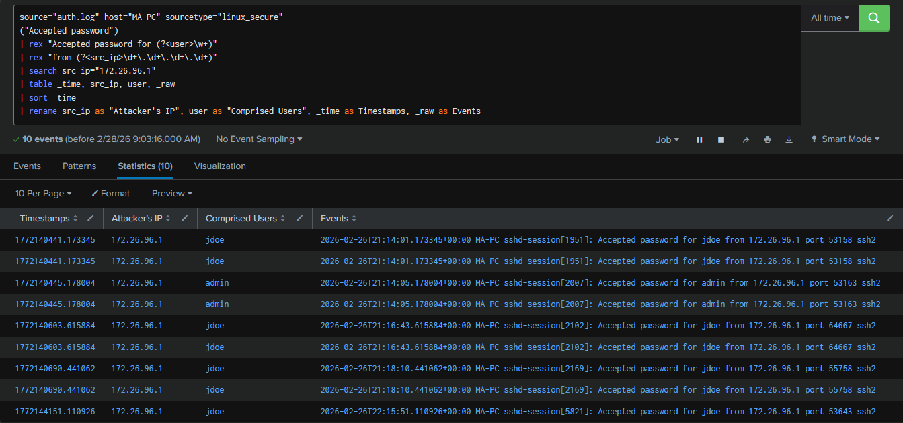
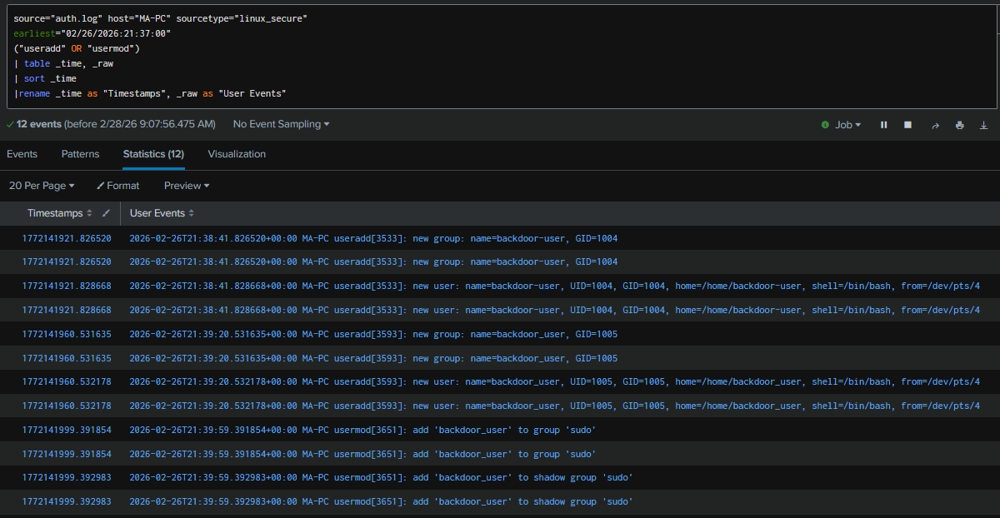

# MITRE ATT&CK Mapping

This document maps the confirmed attacker activities observed during the investigation to the MITRE ATT&CK framework.

All techniques listed below are supported by log evidence collected from `/var/log/auth.log` and analysed on Splunk.

---

## 🔴 1. Brute Force  
**Tactic:** Credential Access  
**Technique:** Brute Force  
**MITRE ID:** T1110  

### Evidence

*Figure 1: Excessive failed SSH authentication attempts from 172.26.96.1 indicating automated brute force activity.*

### Analysis

The attacker performed repeated failed login attempts against SSH services. A high volume of authentication failures (7200 attempts) was observed from a single source IP, consistent with automated brute force behaviour.

---

## 🔴 2. Valid Accounts – Initial Access  
**Tactic:** Initial Access  
**Technique:** Valid Accounts  
**MITRE ID:** T1078  

### Evidence

*Figure 2: Successful SSH authentication for compromised accounts from the attacker's IP.*

### Analysis

Following brute force attempts, successful authentication events were observed for the accounts `jdoe` and `admin` from the same source IP. This confirms the attacker gained valid credential-based access.

---

## 🔴 3. Privilege Escalation – Sudo 
**Tactic:** Privilege Escalation  
**Technique:** Abuse Elevation Control Mechanism: Sudo and Sudo Caching
**MITRE ID:** T1548.003  

### Evidence

*Figure 3: Root session opened via sudo following lateral movement.*

### Analysis

After compromising a standard user account, the attacker escalated privileges to root. Log entries confirm a session opened for user root, demonstrating full system compromise.

---

## 🔴 4. Lateral Movement via Account Switching  
**Tactic:** Lateral Movement  
**Technique:** Valid Accounts  
**MITRE ID:** T1078  

### Evidence

*Figure 4: User account pivot via `su` command before root access.*

### Analysis

The attacker pivoted from the initially compromised account (`jdoe`) to another local account (`svc_backup`) using the `su` command. This demonstrates lateral movement through credential reuse.

---

## 🔴 5. Persistence – Create Local Account  
**Tactic:** Persistence  
**Technique:** Create Account: Local Account  
**MITRE ID:** T1136.001  

### Evidence

*Figure 5: Creation of unauthorised local account `backdoor_user`.*

### Analysis

Following root access, the attacker created a new local account to maintain long-term access. This account was not part of normal system operations and represents a persistence mechanism.

---

## 🔴 6. Account Manipulation – Privileged Group Assignment  
**Tactic:** Persistence / Privilege Escalation  
**Technique:** Account Manipulation  
**MITRE ID:** T1098  

### Evidence

*Figure 6: Addition of backdoor_user to the sudo group, granting administrative privileges.*

### Analysis

The attacker modified group memberships by adding the newly created account to the sudo group. This ensured persistent privileged access even if the original compromised credentials were remediated.

---

# ✅ Summary of Observed Techniques

| Tactic | Technique | MITRE ID |
|--------|------------|----------|
| Credential Access | Brute Force | T1110 |
| Initial Access | Valid Accounts | T1078 |
| Lateral Movement | Valid Accounts | T1078 |
| Privilege Escalation | Sudo Abuse | T1548.003 |
| Persistence | Create Local Account | T1136.001 |
| Persistence / Privilege Escalation | Account Manipulation | T1098 |

---

# 🔎 Overall Assessment

The attacker demonstrated a full compromise lifecycle:

- Credential brute force
- Valid account usage
- Lateral movement
- Privilege escalation
- Persistent privileged access establishment

This activity aligns with common real-world Linux attack patterns.

---
